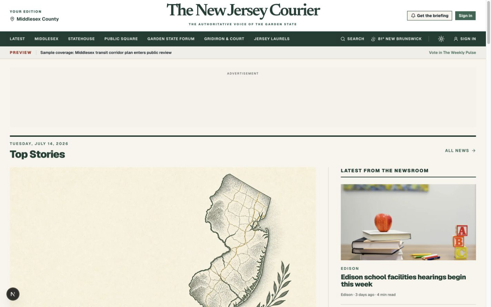
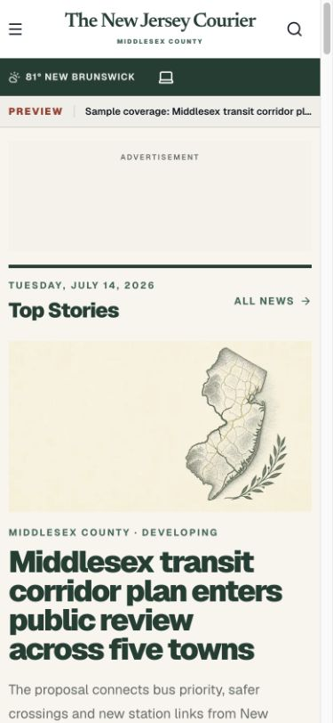
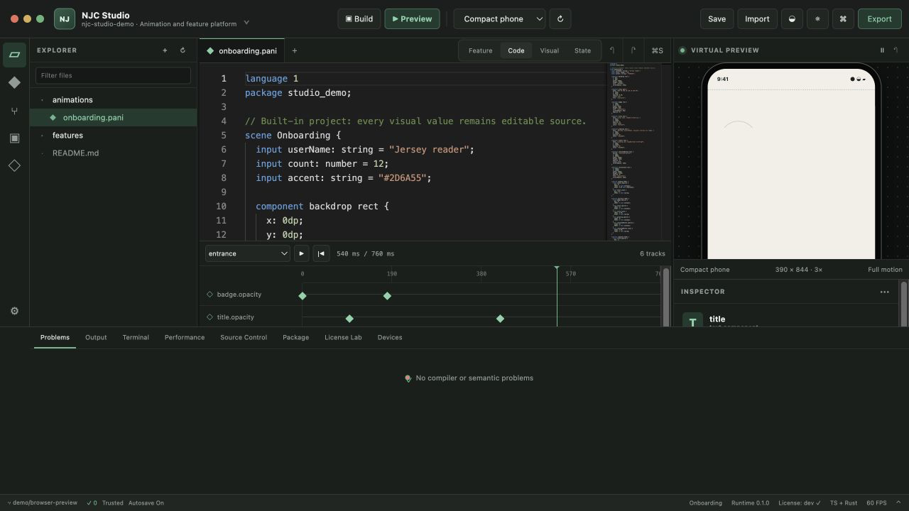
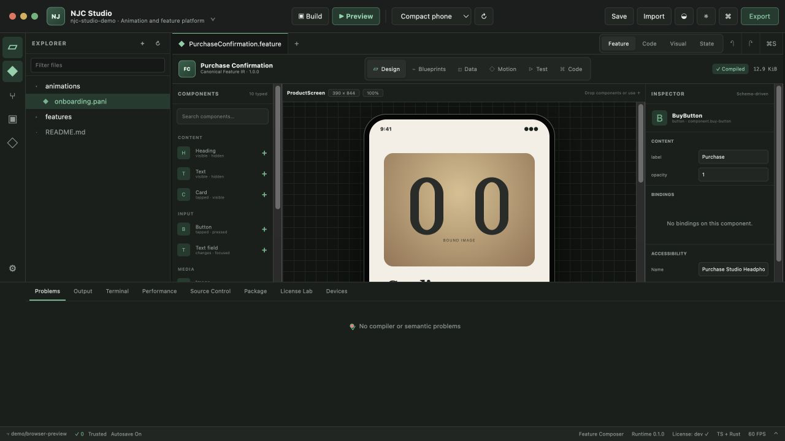

# The New Jersey Courier

**The Authoritative Voice of the Garden State**

The New Jersey Courier is a county-first digital newspaper platform launching in Middlesex County, New Jersey. Its reporting model starts with municipal government, schools, transportation, accountability, civic life and high-school sports, then connects those local consequences to a dedicated Statehouse desk.

> This repository is a launch preview. Seed articles, people, polls and results are fictional demonstrations until the newsroom publishes verified reporting.



## Editorial products

- **Middlesex County Desk** — town-by-town reporting across all 25 municipalities
- **Politics & Statehouse Desk** — Trenton reporting translated into local consequences
- **Garden State Forum** — clearly labeled local opinion and op-eds
- **Public Square / Weekly Pulse** — transparent, non-scientific civic polling with Sunday context
- **Jersey Gridiron & Court** — high-school sports and moderated Player of the Week ballots
- **Jersey Laurels** — annual, reader-nominated community recognition
- **Courier Watch** — public records, service journalism and accountability reporting

## Platform surfaces

```text
apps/
  web/       Next.js newspaper, newsroom Studio, legal center and public APIs
  mobile/    Shared Expo application for iOS and Android
  employee/  Separate privileged Expo application for employee iOS and Android
  tv/        Shared react-native-tvos application for Apple TV and Android/Google TV
  roku/      Native Roku SceneGraph application
  cdn/       Versioned asset source; same-origin now, CDN-ready later
packages/
  api-client/  Shared platform-neutral API requester
  backend/     Neon/Postgres and Drizzle data layer
  contracts/   Shared TypeScript API contracts
platform/      Licensable feature host, entitlement system and animation runtime
tools/studio/  Tauri desktop IDE for animation and feature development
visual-feature-platform/  Extractable visual feature model, compiler, runtime and playground
docs/          Architecture, operations, APIs, pairing and brand standards
```

The stack is TypeScript-first: Next.js App Router, Expo/React Native, Neon Postgres, Drizzle, Clerk, Upstash and Vercel Blob. Roku uses the native BrightScript/SceneGraph runtime. C or C++ is reserved for measured native performance needs behind a maintained cross-platform boundary.

## Brand and assets

Canonical assets live in [`apps/cdn/public/assets`](apps/cdn/public/assets). Every published pathname is versioned and immutable. The web app mirrors those files before development and production builds, so the initial Vercel deployment serves them from the same generated hostname:

```text
https://<your-vercel-project>.vercel.app/assets/brand/v1/mark.svg
```

No domain or separate CDN project is required. Later, set `NEXT_PUBLIC_ASSET_ORIGIN` to a dedicated Vercel asset project or `https://cdn.njcourier.com`; asset paths do not change.

See the [brand guide](docs/brand/BRAND_GUIDE.md), [asset catalog](docs/brand/ASSET_CATALOG.md), and [CDN deployment guide](docs/CDN.md).



## Local preview

```bash
pnpm install
pnpm dev
```

Open `http://localhost:3000`. To review Studio locally, connect Clerk in `apps/web/.env.local` and sign in with an approved newsroom account. Studio intentionally has no demo authentication bypass.

## Vercel deployment

Create one Vercel project from this repository:

1. Name it something available such as **new-jersey-courier** and set Root Directory to `apps/web`.
2. Vercel will provide an HTTPS production alias such as `https://new-jersey-courier.vercel.app`, plus unique preview URLs for branches and pull requests.
3. Leave `NEXT_PUBLIC_SITE_URL` and `NEXT_PUBLIC_ASSET_ORIGIN` unset. The app detects Vercel’s URL and serves assets from `/assets` automatically.

Install Neon, Clerk, Vercel Blob and Upstash for the web project. Production deployments apply the committed Drizzle migrations before Next.js builds and fail closed if the database is missing or outdated; preview and local builds never mutate the production schema. Production starts empty, so publish verified reporting through Studio instead of seeding preview content. Vercel automatically CDN-caches static deployment assets; public newsroom uploads use Vercel Blob.

The Hobby deployment runs `/api/cron/publish-scheduled` once daily at `10:00 UTC`, which complies with Vercel's Hobby cron limit. Upgrade the project before restoring a more frequent schedule; Studio can still publish time-sensitive stories manually at any time.

When a domain is purchased, follow the [custom-domain launch runbook](docs/DOMAIN_LAUNCH.md). It covers the Vercel primary-domain redirect, `NEXT_PUBLIC_SITE_URL`, Clerk production keys and DNS, canonical/SEO checks, optional `cdn.<domain>`, native-app follow-up and rollback. A second `apps/cdn` project remains optional.

Copy [`apps/web/.env.example`](apps/web/.env.example) for configuration names. Never commit `.env.local`.

## Portable operations

The newsroom can export an encrypted, provider-neutral archive containing the database, migrations, public media inventory, configuration names and restore instructions:

```bash
pnpm backup:export
pnpm backup:restore
```

See [portable backup and restore](docs/PORTABLE_BACKUP.md).

## Media press kits

The public `/press` workflow generates a tailored ZIP from the approved brand library, publication background and editorial illustration. Each package includes the requester’s brief, usage terms and a checksum manifest. Production requests are rate-limited with Upstash, logged for authorized Studio users and included in portable database exports. See [press-kit generation and operations](docs/PRESS_KIT.md).

## Search visibility

The web app includes canonical metadata, `NewsArticle` and publisher structured data, general and Google News sitemaps, RSS, social previews, search-engine verification hooks and CMS-level SEO controls. Indexing remains disabled by default for local and preview deployments. The current Vercel production alias was verified in Google Search Console and explicitly enabled for indexing on July 22, 2026; follow the [SEO launch and measurement guide](docs/SEO.md) for the crawler-cache status, publishing cautions and future custom-domain migration.

## Verification

```bash
pnpm lint
pnpm typecheck
pnpm build
pnpm mobile:check
pnpm employee:check
pnpm employee:export
pnpm tv:check
pnpm roku:check
pnpm platform:check
pnpm platform:conformance
pnpm platform:demo
pnpm platform:benchmark
pnpm playground:check
pnpm composer:check
```

The separate animation playground runs with `pnpm playground:start` on port 3010. Platform architecture, licensing, language/SDK guides and explicit native limitations are indexed from [`platform/README.md`](platform/README.md).

## NJC Studio

The repository includes **NJC Studio**, a Tauri 2 desktop environment with Monaco source editing, structured visual and timeline edits, the real animation compiler/runtime, an integrated virtual-device preview, project detection, workspace trust, allow-listed tasks, package inspection, state-machine tracing and toolchain diagnostics. Its VS Code-inspired information architecture is original to The New Jersey Courier, and its create → edit → build → preview workflow is functional in both the browser fixture and native desktop shell.



```bash
pnpm studio:start
pnpm studio:check
pnpm studio:build
```

See [`tools/studio/README.md`](tools/studio/README.md) for the working workflow, security boundary, screenshot and explicit remaining milestones.

NJC Studio's **Feature** tab provides synchronized Design, NJC Blueprints, Data, Motion, Test and readable English-programming Source modes. Its extraction-ready compiler/runtime workspace and standalone playground are documented in [`visual-feature-platform/README.md`](visual-feature-platform/README.md). Release gates and the signing work that still requires owner credentials are documented in [`tools/studio/docs/PRODUCTION_READINESS.md`](tools/studio/docs/PRODUCTION_READINESS.md).


