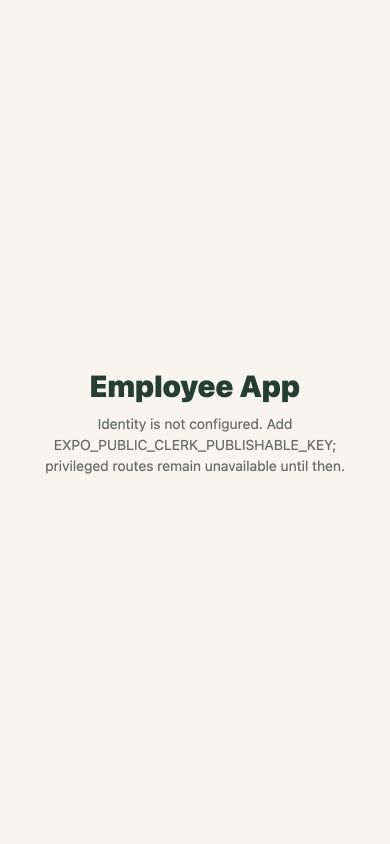

# NJ Courier Employee App

This Expo application is the separate privileged iOS and Android client for
employee communication and operational tools. It reuses contracts, API clients,
theme tokens and identity infrastructure without placing administrative UI or
privileged logic in the reader app.



The capture shows the intentional locked bootstrap state when Clerk identity is
not configured. Authenticated dashboards, channels, DMs, tools, notifications,
profiles and deep-linked resources must not be committed as screenshots with
real employee data.

## Routes

- `(tabs)` — home, chat, tools, notifications and profile
- `chat/[id]` — permission-checked channel or conversation
- `tools/[tool]` — capability-gated employee workflow
- `access-request` — eligibility request and status
- `v1/[...path]` — versioned deep-link resolver
- `sign-in` and `unsupported-link` — safe recovery surfaces

## Verification

```bash
pnpm --dir apps/employee test
pnpm --dir apps/employee typecheck
pnpm --dir apps/employee lint
pnpm --dir apps/employee export:ios
pnpm --dir apps/employee export:android
```
