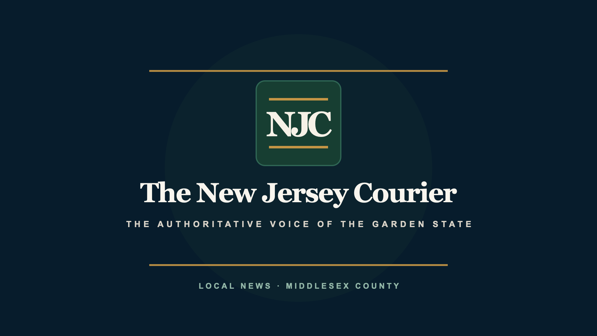

# The New Jersey Courier for Roku

New Jersey Courier’s Roku client is a native SceneGraph application written in BrightScript. It reads the same Vercel-hosted `/api/v1` stories, weather, live HLS and device-pairing endpoints as the other clients while reporting Roku installations separately in Studio analytics.



The image above is the committed production splash, not a claim of completed
Channel Store screenshots. Remote focus, article pagination and playback must
still be photographed on the physical-device certification matrix.

## What works

- A ground-up custom masthead, focus system and editorial front page driven by Studio's supported navigation and feature configuration
- Section-aware story loading, lead-story presentation and a remote-first story rail
- Modal article reading with complete paragraph pagination, Up/Down and Rewind/Fast Forward controls, a position indicator and focus restoration on Back
- Live HLS playback through Roku’s native `Video` node
- Weather conditions and alerts
- System, light and dark appearance preferences stored in the Roku registry
- Public access without an account
- Optional secure QR/manual sync-code linking with 60-second rotation, a frozen processing state, conflict protection, five-second success confirmation and a revocable 90-day device token
- Persistent account and beta-entitlement validation, with the Connect entry removed after successful linking
- Validated last-known-good Studio configuration plus bounded story/config refresh and explicit loading, empty, offline and retry states
- Anonymous Roku installation presence with no reading history or advertising identifier
- Launch channel icon and splash artwork for FHD, HD and SD televisions
- A separately labeled beta artwork set bundled for entitled accounts inside the same app

The reader API also retains a bounded compatibility profile for the immutable
Roku 1.0.0 contract. It restores that build&apos;s historical user-agent access,
converts relative artwork, and folds every representable current story field
into the single body value that build reads, with any public story note last.
See [Reader API compatibility](../../docs/operations/READER_API_COMPATIBILITY.md)
for the exact contract and the client-side behavior that still requires an app
update.

Roku does not currently expose a documented app-facing light/dark appearance preference. The `System` choice therefore uses New Jersey Courier’s television-optimized dark palette; explicit Light and Dark choices remain available and persistent.

## Validate and build

The committed manifest uses the permanent production API origin, `https://njc-web.vercel.app`, so both ordinary builds and hardware-test packages connect to the live Courier service:

```bash
pnpm roku:check
pnpm roku:build
```

Create the production ZIP using that origin:

```bash
pnpm roku:package
```

The result is `apps/roku/dist/njcourier-roku.zip`. Its root contains `manifest`, `images/`, `source/` and `components/`, as required by the Roku Developer Application Installer. `ROKU_API_URL=https://another-origin.example pnpm roku:package` remains available as an explicit build-time override; production packaging rejects placeholder hosts and URLs containing credentials, paths, queries or fragments.

Normal and beta artwork live in the same `njcourier-roku.zip` application package. The committed manifest always uses the normal icon and initial splash because Roku displays both before the app can validate a linked account. After startup, the app validates the account-backed `releaseChannel` entitlement and displays beta or alpha flair for approved testers. Production users and failed or expired entitlement checks always receive the normal experience.

The beta artwork is therefore available to beta-only in-app experiences without creating a second Roku application, store listing, installation, or device token. There is no client-side beta switch.

For LAN testing only, an HTTP origin can be packaged with `ROKU_ALLOW_HTTP=1`. Production should always use HTTPS.

## Sideload on a Roku

Enable developer mode on the Roku, record its LAN IP and developer password, then run:

```bash
pnpm roku:package
ROKU_DEV_TARGET=192.168.1.50 DEVPASSWORD='your-device-password' pnpm roku:install
```

The second command uploads the existing ZIP to the device’s Developer Application Installer. A physical Roku is required for final remote-focus, video codec, memory and device-family testing.

## Store submission note

Current Roku certification guidance requires non-TVE apps that require authentication to support an on-device authentication path. New Jersey Courier’s news, weather and live coverage do not require an account; QR/code linking is an optional personalization convenience. Before a Roku Channel Store submission, confirm the current authentication rules with Roku and add an approved on-device OAuth/AAL flow if Roku treats optional linking as an authenticated experience. Do not make remote-only linking a gate to public news.

The launch package still needs final Channel Store screenshots, privacy disclosures, content ratings, streaming-rights confirmation and device-matrix certification. The custom interface, remote reader and pairing lifecycle must also be accepted on representative low-powered and current physical Roku devices; static validation and BrightScript compilation do not replace that hardware pass.
