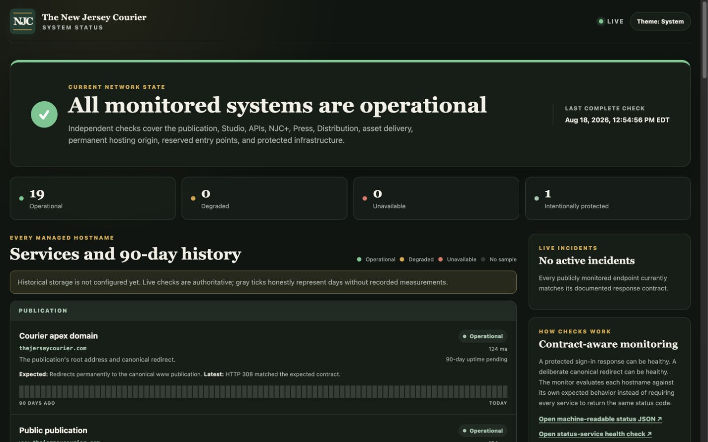

# NJ Courier status service

This independently deployed Next.js application powers
`status.thejerseycourier.com`. It checks each managed hostname against its own
expected response contract, publishes latency and incident history, and stays
separate from the publication it monitors.



The page intentionally omits credentials, internal topology, customer data and
the connection-gated internal hostname. Operational details live in the
[status-service runbook](../../docs/operations/STATUS_SERVICE.md).

```bash
pnpm --dir apps/status test
pnpm --dir apps/status typecheck
pnpm --dir apps/status lint
pnpm --dir apps/status build
```
