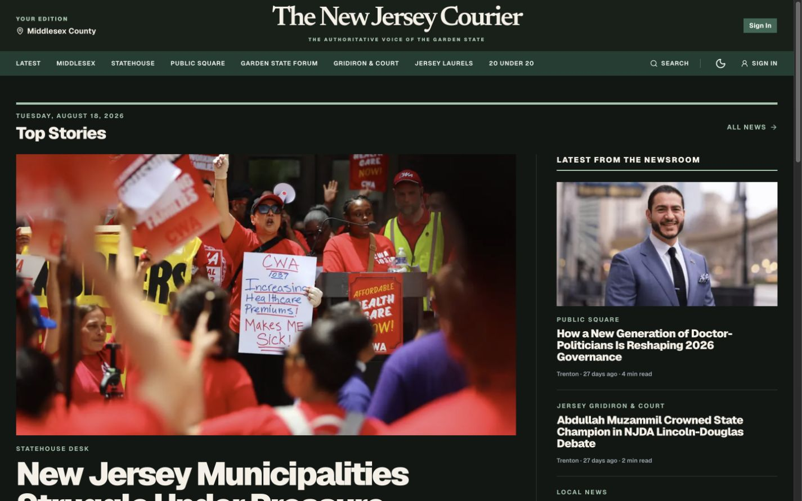

# NJ Courier web application

This Next.js application is the shared Vercel deployment behind the public
publication, Newsroom Studio, NJC+, Press & Media, Distribution, Link in Bio,
reader authentication, television pairing and versioned APIs. Host-aware
routing selects the correct first-party surface without duplicating backend or
asset infrastructure.



## Product areas

- `(site)` contains the public newspaper, sections, stories, authors, search,
  service journalism and legal pages.
- `studio` contains permission-aware editorial and operational tools.
- `plus` contains the gated NJC+ reader experience.
- `press-portal` and `distribution` provide purpose-built external workflows.
- `login`, `sign-in`, `sign-up` and `profile` provide reader identity flows.
- `api` contains reader, newsroom, employee, platform and webhook contracts.

The exhaustive visual route inventory is in [PAGES.md](PAGES.md). It maps each
page pattern to a real dark-mode capture or, for protected/state-dependent
routes, to the exact access or release boundary a signed-out reader receives.

## Development

```bash
pnpm --dir apps/web dev
pnpm --dir apps/web test
pnpm --dir apps/web typecheck
pnpm --dir apps/web lint
pnpm --dir apps/web build
```

Environment setup, database migrations, Vercel domains and security controls
remain documented in the root README and the runbooks under `docs`.
