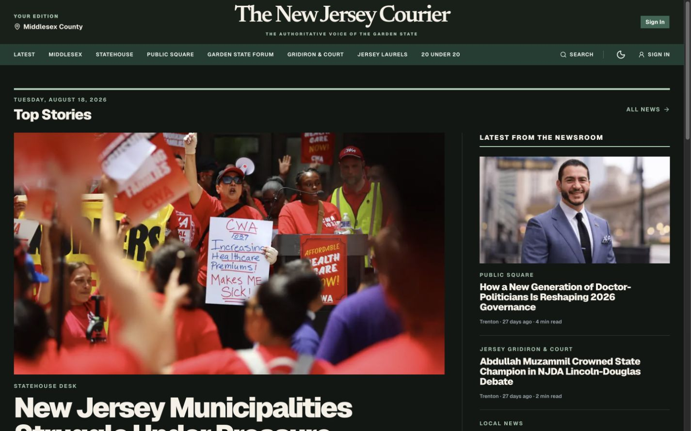

# NJ Courier web application

## Studio MagEngine

The privileged `/studio/mag-engine` workspace creates structured magazine
drafts and imports PDF exports made in Blurb BookWright. Native drafts can use
approved newsroom images; PDF imports are stored in the private Blob store,
proxied through a role-checked endpoint, and previewed with StPageFlip/PDF.js.
An approved issue here is an internal Studio state only: no reader-facing
magazine route or public PDF delivery is created by this module.

See [MagEngine architecture, configuration and rollout](../../docs/studio/MAGENGINE.md).

This Next.js application is the shared Vercel deployment behind the public
publication, Newsroom Studio, NJC+, The Courier Cut, Press & Media, Distribution, Link in Bio,
reader authentication, television pairing and versioned APIs. Host-aware
routing selects the correct first-party surface without duplicating backend or
asset infrastructure.



## Product areas

- `(site)` contains the public newspaper, sections, stories, authors, search,
  service journalism, the **In the Community** autumnal event bulletin, and
  legal pages.
- `studio` contains permission-aware editorial and operational tools.
  **Community desk** manages private reader event submissions and the public
  bulletin; see [its workflow](../../docs/COMMUNITY_BULLETIN.md).
- `plus` contains the gated NJC+ reader experience.
- `courier-cut` is the non-indexed, invitation-only host surface. Studio can
  keep authorized playback in NJC+ or add the dedicated host, but cannot select
  a Courier-Cut-only mode.
- `press-portal` and `distribution` provide purpose-built external workflows.
- `login`, `sign-in`, `sign-up` and `profile` provide reader identity flows.
- `api` contains reader, newsroom, employee, platform and webhook contracts.

The exhaustive visual route inventory is in [PAGES.md](PAGES.md). It maps each
page pattern to a real dark-mode capture or, for protected/state-dependent
routes, to the exact access or release boundary a signed-out reader receives.

## Development

```bash
pnpm --dir apps/web dev
pnpm --dir apps/web test
pnpm --dir apps/web typecheck
pnpm --dir apps/web lint
pnpm --dir apps/web build
```

Environment setup, database migrations, Vercel domains and security controls
remain documented in the root README and the runbooks under `docs`.
