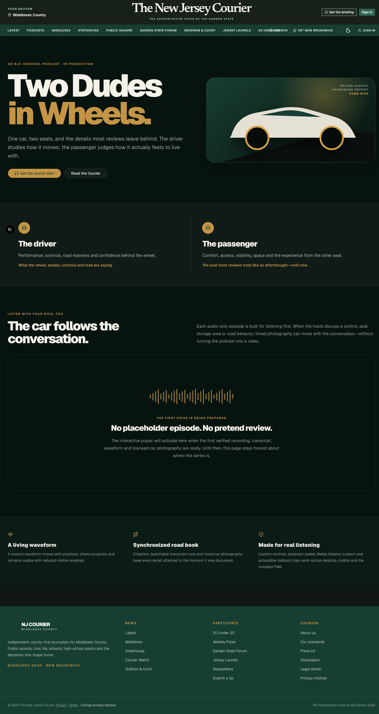

# Two Dudes in Wheels

**Two Dudes in Wheels** is an in-production, public NJC original podcast about
the same car from two deliberately different seats. The driver covers controls,
road manners, performance and confidence. The passenger covers comfort,
visibility, access, space and the parts of everyday travel that conventional car
reviews often compress into a sentence.

The client route is `/podcasts/two-dudes-in-wheels`. It is part of the main
publication and is not automatically paywalled behind NJC+. The site navigation
adds **Podcasts** after **Latest**, including for older stored navigation
configuration, without duplicating a manually configured route.

## Audience experience

The public page is production-honest: until a real episode is available it says
the show is in production and does not invent a review, vehicle, release date or
audio file. A published episode activates the purpose-built client player:

- audio-only playback with play/pause, 15-second seek, scrubbing, mute and speed;
- a custom animated waveform and elapsed/remaining time;
- timed, accessible car photography that crossfades as the hosts discuss it;
- explicit driver, passenger, both-seats and road-context visual perspectives;
- synchronized speaker transcript cues and seekable full transcript;
- chapter navigation and share support;
- browser/PWA Media Session integration for system playback controls;
- reduced-motion behavior and a visual fallback when no timed photo is active.

## Episode contract

`apps/web/src/lib/two-dudes-in-wheels.ts` is the current code-owned release
pipeline. This increment intentionally adds no Studio administration. Each real
episode must pass the validated contract before it can render. The contract
requires an HTTPS or local audio asset, declared duration, real vehicle identity,
publication instant, bounded waveform data, accessible visual descriptions,
timed visual/transcript cues and optional chapters. Cue and chapter identifiers
must be unique and no timed item may extend beyond the episode.

The player never discovers arbitrary media paths and never substitutes a fake
episode when the catalog is empty. Actual car photography must be licensed for
publication and delivered through an allowed first-party/CDN/Blob origin.

## Release checklist

Before adding the first episode:

1. Publish the final audio file and its measured duration.
2. Generate normalized waveform peaks from that final audio master.
3. Prepare the complete reviewed transcript and speaker timing.
4. License, caption and write alt text for every car image.
5. Place visual cues only where the conversation actually references the view.
6. Verify chapter times against the final audio master.
7. Test keyboard, screen reader, reduced motion, Media Session, iOS Safari,
   Android Chrome/PWA and desktop browsers.
8. Confirm the structured podcast metadata and sitemap URL in production.

Safe recording and vehicle operation take precedence over production. Nothing
in the player requires a host or passenger to operate the page while driving.
