# Product screenshot catalog

These captures document production surfaces of The New Jersey Courier as they
appeared on August 18, 2026. They use real public pages, not mocked account
data. Protected screens are shown only at their public access boundary so the
repository does not publish reader, staff, financial, analytics, invitation,
or unreleased-content information.

The expanded [dark-mode route library](dark/README.md) covers every public web
page, safe access boundary, mobile shell and developer workbench that can be
truthfully captured without publishing private data. Its route-level index is
maintained in [`apps/web/PAGES.md`](../../apps/web/PAGES.md).

## Publication

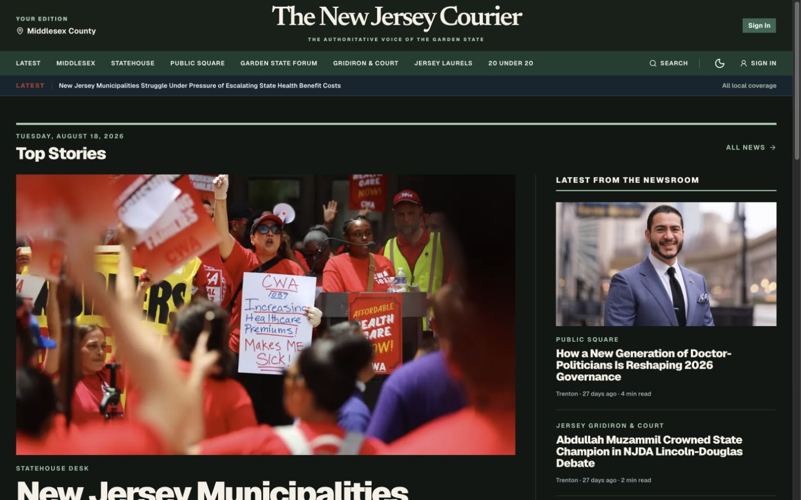

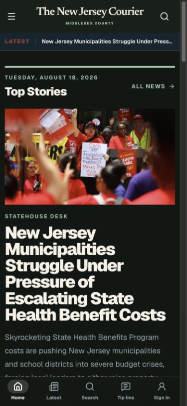

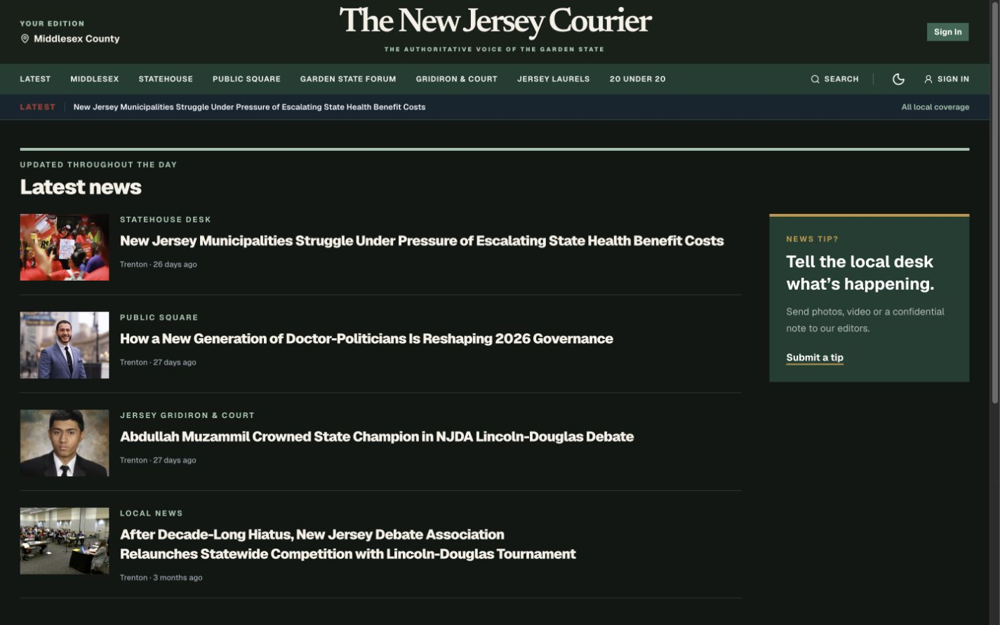

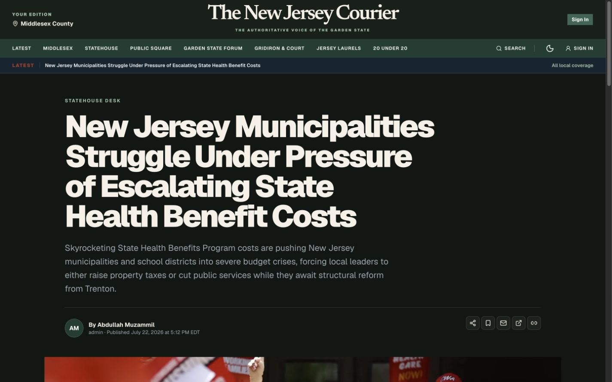

## Community and newsroom access

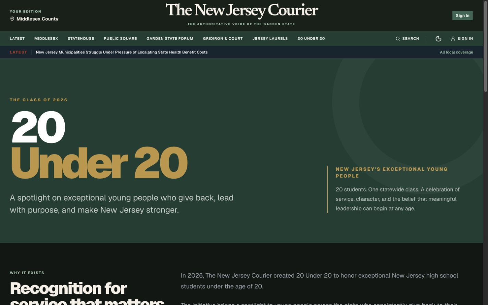

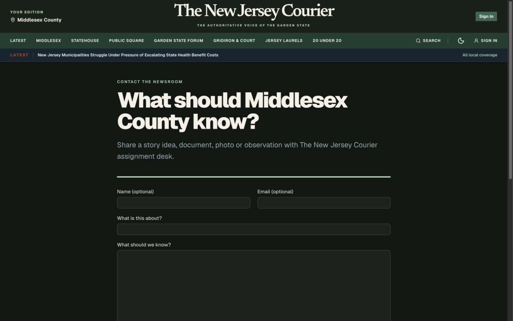

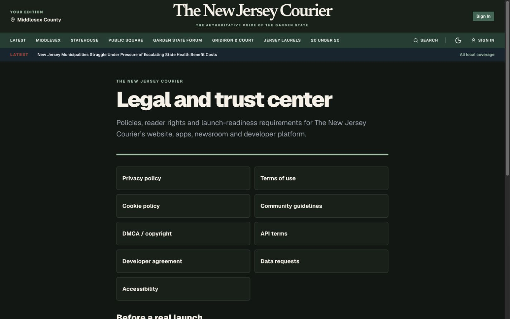

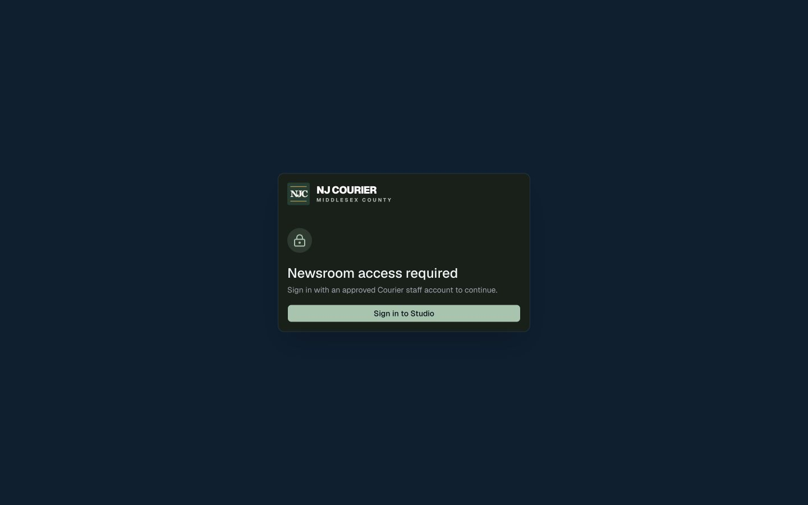

## First-party services

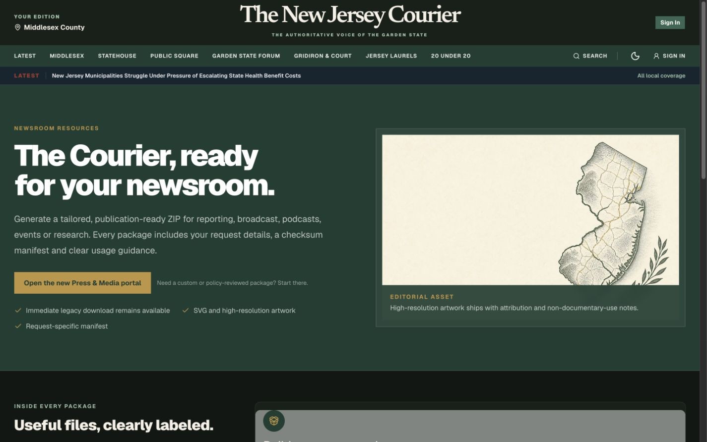

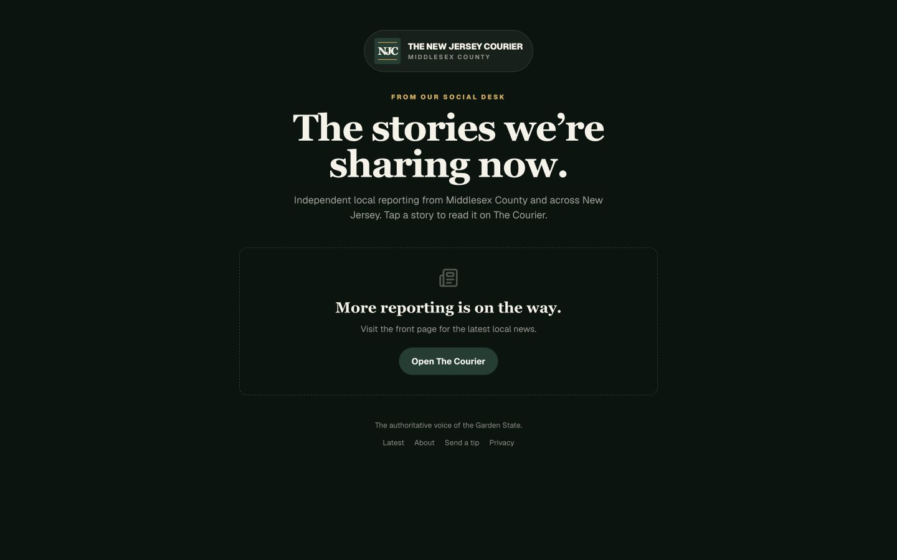

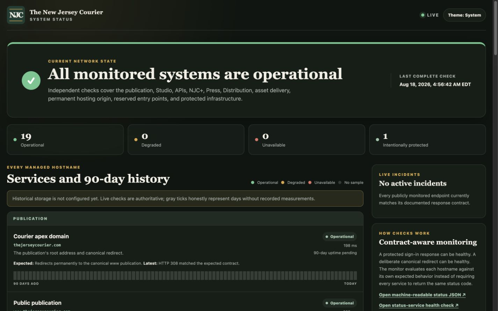

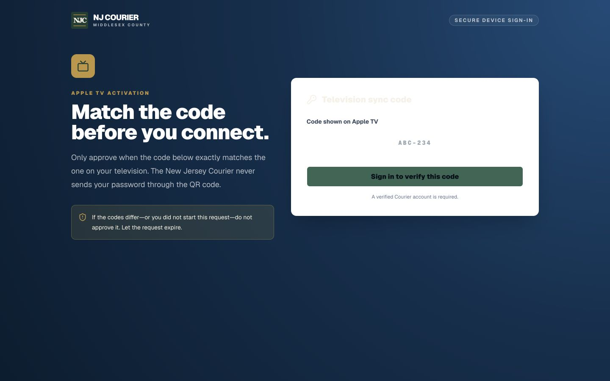

## Capture policy

- Capture live production behavior only after checking the page title, route,
  and primary content.
- Never publish authenticated account details, private packages, preview cuts,
  staff analytics, finance information, access tokens, or active pairing codes.
- Do not represent disabled or redirected products as launched. NJC+ and The
  Courier Cut should receive new screenshots only after their release gates and
  real-account security validation pass.
- Replace images when a material interface revision ships; keep documentation
  copy and screenshots in the same commit.
