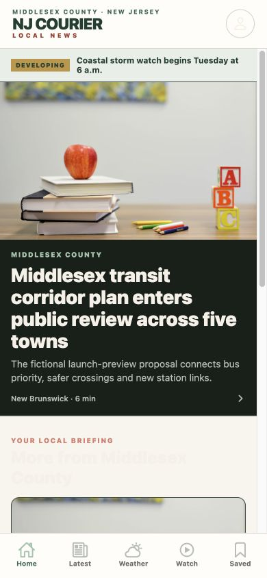
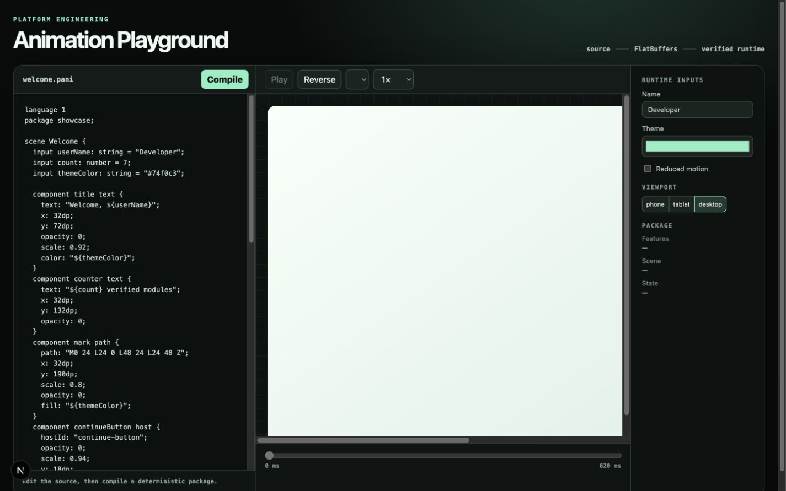

# Dark-mode screenshot library

This folder is the August 18, 2026 production/documentation capture set. Public
web pages use the live Courier system-dark presentation at a 1440×900 desktop
viewport. Mobile client images use a 390×844 viewport. Local workbench captures
come from the checked-out implementation and are labeled as such in their
owning README.

The complete route-to-image mapping is maintained in
[`apps/web/PAGES.md`](../../../apps/web/PAGES.md). Application ownership is
indexed in [`apps/README.md`](../../../apps/README.md), while source-only shared
workspaces are indexed in [`packages/README.md`](../../../packages/README.md).

## Publication

## Services and protected boundaries

## Clients and developer workbenches

## Safety rules

- Never capture authenticated staff, reader, financial, analytics, entitlement
  or unreleased editorial data for public repository documentation.
- Never capture active pairing codes, package tokens, API keys or private URLs.
- Represent protected route families with their public access boundary.
- Represent disabled releases with their real release-gate destination.
- Replace a capture when the corresponding page changes materially, and update
  its route description in the same commit.
