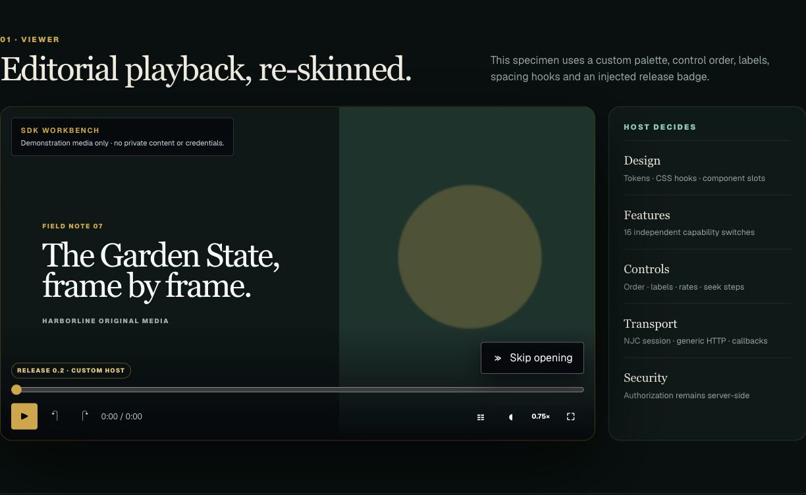
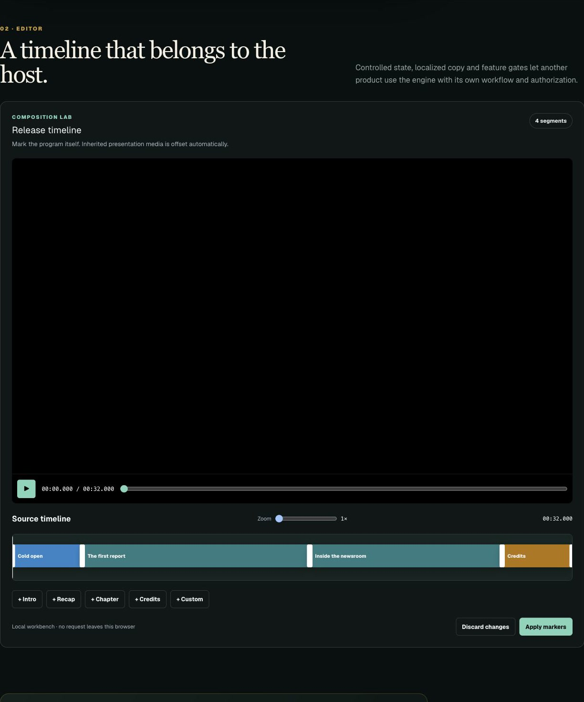

# `@harborline/media-player`

A portable, proprietary React package containing the playback engine and the
editorial timeline controls first used by NJC+. The package is deliberately
brand-neutral: a host supplies its own colors, identity, persistence endpoint,
authorization and storage URLs.





## What travels with the package

- one video/audio control surface;
- optional platform intro plus measured black/silence transition;
- source-relative intro, recap, chapter, credits and custom markers;
- contextual skip controls that reappear after a rewind;
- chapter navigation;
- captions, speed, picture-in-picture, fullscreen and resume position;
- private-preview notice presentation;
- a controlled visual timeline editor with scrubbing, zoom, draggable bounds,
  exact millisecond fields, overlap review, validation and save/discard hooks;
- framework-neutral composition and validation helpers.
- per-capability feature switches, arbitrary control ordering, multiple caption
  tracks, configurable seek steps and playback-rate lists;
- replaceable loading, notice, skip, audio-identity and control slots;
- stable class hooks, optional CSS and an expanded design-token contract;
- callback, generic HTTP and NJC session transport adapters.

The package does **not** contain NJC authentication, database access, private
media authorization or arbitrary upload behavior. Those remain the host
application's responsibility.

## Install

Inside this monorepo:

```bash
pnpm add @harborline/media-player@workspace:*
```

For another private project, create an installable archive:

```bash
pnpm --dir packages/media-player pack --pack-destination ../../artifacts
pnpm add /path/to/harborline-media-player-0.2.0.tgz
```

The archive contains compiled ESM, declarations, source maps and the themeable
stylesheet. The package is currently `UNLICENSED`; publishing it to a registry
requires an explicit ownership/licensing and registry-access decision.

## Viewer

```tsx
import { MediaPlayer, type PlayerProgressEvent } from "@harborline/media-player";
import "@harborline/media-player/styles.css";

export function Program({ program }: { program: Program }) {
  async function persist(event: PlayerProgressEvent) {
    await fetch(`/api/programs/${event.contentId}/progress`, {
      method: "PUT",
      headers: { "Content-Type": "application/json" },
      body: JSON.stringify(event),
    });
  }

  return (
    <MediaPlayer
      contentId={program.id}
      kind="video"
      src={program.url}
      poster={program.poster}
      captionsUrl={program.captions}
      title={program.title}
      initialPositionMs={program.resumeAtMs}
      timelineSegments={program.timeline}
      platformIntro={program.platformIntro}
      branding={{ title: "YOUR BRAND", subtitle: "Original presentation" }}
      onProgress={persist}
      features={{ platformIntro: false, pictureInPicture: false }}
      controlOrder={["play-pause", "seek-backward", "seek-forward", "time", "chapters", "volume", "fullscreen"]}
      playbackRates={[0.75, 1, 1.5, 2]}
      seekStepSeconds={5}
      style={{ "--harbor-media-accent": "#ff4f70" } as React.CSSProperties}
    />
  );
}
```

`onProgress` receives source-program time, never the inherited intro offset.
The callback is the correct place to attach the new site's authenticated API.

## Customize from top to bottom

There is no required NJC visual layer. Consumers choose one of three levels:

1. Import the supplied stylesheet and override tokens.
2. Add `classNames` and `slots` to replace individual regions and controls.
3. Do not import `styles.css`; use the semantic component markup or the
   exported timeline helpers to build an entirely original surface.

```tsx
<MediaPlayer
  {...program}
  features={{ platformIntro: false, previewNotice: false, captions: false }}
  controlOrder={["play-pause", "time", "chapters", "volume", "fullscreen"]}
  labels={{ chapters: "Scenes", fullscreen: "Enter theater mode" }}
  classNames={{ root: styles.player, controls: styles.controls }}
  slots={{
    loading: () => <BrandLoader />,
    beforeControls: <ReleaseBadge />,
    control: ({ id, onPress, defaultControl }) =>
      id === "play-pause" ? <BrandPlayButton onClick={onPress} /> : defaultControl,
  }}
/>
```

Every control capability is independently switchable. `controlOrder` may omit
controls entirely, while `slots.control` can replace a control without forking
the playback state machine. Multiple caption tracks, seek size, rate list,
preload policy, CORS mode, ARIA copy and all visible labels are host-owned.

`TimelineEditor` has the same design philosophy: `features` can remove its
header, preview, zoom, add buttons, inspector, validation surface or actions;
`labels`, `classNames` and `style` replace copy and presentation. It remains a
controlled component. For a totally different admin UX, render your own UI and
reuse `validateTimeline`, `composePlaybackTimeline` and the exported types.

## Bring NJC or bring your own backend

The package never requires an NJC endpoint. A consumer can keep using the
simple `onProgress`/`onSave` callbacks or create an adapter:

```tsx
import { createHttpMediaAdapter } from "@harborline/media-player/adapters";

const adapter = createHttpMediaAdapter({
  baseUrl: "https://media.your-site.example",
  credentials: "include",
  headers: () => ({ Authorization: `Bearer ${getHostSession()}` }),
  routes: {
    presentation: (slug) => `/v2/programs/${encodeURIComponent(slug)}`,
    progress: "/v2/playback/progress",
    timeline: (id) => `/v2/admin/programs/${encodeURIComponent(id)}/timeline`,
  },
  parsePresentation: parseYourPresentation,
  parseTimeline: parseYourTimeline,
});

<MediaPlayer {...presentation} dataAdapter={adapter} />
```

Routes are optional. Consumers may implement the `MediaDataAdapter` interface
directly for GraphQL, tRPC, native bridges, offline storage or another API.
The host must still authorize each request server-side.

### NJC integration

NJC+ playback uses the existing Clerk cookie and entitlement checks—**not a
developer API key**:

```ts
import { createNjcSessionMediaAdapter } from "@harborline/media-player/adapters";

const adapter = createNjcSessionMediaAdapter({
  baseUrl: "https://www.thejerseycourier.com",
  devicePlatform: "web",
});
```

This adapter targets the versioned NJC+ presentation/progress endpoints and
the capability-protected Studio timeline endpoint. `credentials: "include"`
preserves the same session, but the server remains the authority. It will not
turn a public API key into premium or Studio access.

The existing NJC developer key can optionally load the **published public news
catalog** from trusted server code:

```ts
import { createNjcDeveloperNewsClient } from "@harborline/media-player/njc-server";

const news = createNjcDeveloperNewsClient({
  baseUrl: "https://api.thejerseycourier.com",
  apiKey: process.env.NJC_API_KEY!,
});
const stories = await news.listStories({ limit: 20 });
```

Never import that entry point into a browser bundle or put `NJC_API_KEY` in a
`NEXT_PUBLIC_*` variable. The developer API only provides public stories with
the granted `news:read` scope; private media, resume progress and Studio writes
remain session/role/entitlement protected.

## Admin timeline

```tsx
import { TimelineEditor, type TimelineSegment } from "@harborline/media-player";

function AdminTimeline({ initial }: { initial: TimelineSegment[] }) {
  const [segments, setSegments] = useState(initial);

  return (
    <TimelineEditor
      mediaUrl="https://authorized.example/program.mp4"
      durationMs={3_600_000}
      segments={segments}
      onChange={setSegments}
      onSave={(next) => saveAuthorizedTimeline(next)}
      onDiscard={() => setSegments(initial)}
    />
  );
}
```

The editor is controlled. It never fetches, grants access or saves by itself.
The host must authenticate and authorize every load/save and validate the
submitted markers server-side. `validateTimeline()` is useful shared input
validation, but it is not an authorization layer.

## Theme tokens

Override these CSS custom properties on either component:

| Token | Default |
| --- | --- |
| `--harbor-media-accent` | `#b9ff4a` |
| `--harbor-media-ink` | `#05070c` |
| `--harbor-media-panel` | `#101722` |
| `--harbor-media-panel-soft` | `#192231` |
| `--harbor-media-text` | `#f7f9fc` |
| `--harbor-media-muted` | `#aab4c2` |
| `--harbor-media-line` | `#ffffff24` |
| `--harbor-media-danger` | `#ff7b7b` |
| `--harbor-media-radius` | `0` |
| `--harbor-media-control-radius` | `.25rem` |
| `--harbor-media-control-size` | `2.5rem` |
| `--harbor-media-shadow` | `0 2rem 7rem #0009` |
| `--harbor-media-control-background` | `transparent` |
| `--harbor-media-control-hover` | `#ffffff12` |
| `--harbor-media-controls-gradient` | dark fade |
| `--harbor-media-skip-background` | `#05070ce8` |
| `--harbor-media-notice-background` | `#05070cce` |
| `--harbor-media-font` | `inherit` |

All viewer labels can also be localized through the `labels` prop.

The safe visual workbench lives at `/dev/media-player`; its synthetic media and
screenshots contain no account data, private source URL, API key or release.

## Boundaries and current limitations

- React 18.2+ and a browser with HTML media support are required.
- The package composes ordinary media sources in one control surface. It does
  not transcode or stitch adaptive HLS/DASH manifests.
- The host owns signed URLs, DRM, range requests, entitlements and analytics.
- The NJC developer client is server-only and covers public news, not premium
  content or administrative operations.
- Native iOS, Android, tvOS, Android TV and Roku still need native renderers for
  the same exported timeline contract; this React package does not pretend to
  be a native player.
- Package updates use semantic versions. A future consumer should pin a version
  and test its own persistence/authorization adapter before upgrading.

## Verification

```bash
pnpm --dir packages/media-player test
pnpm --dir packages/media-player typecheck
pnpm --dir packages/media-player build
pnpm --dir packages/media-player pack --pack-destination /tmp/harborline-player
```
