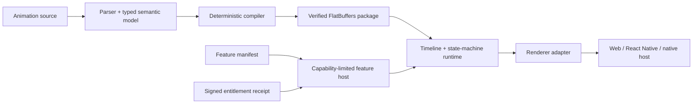

# Platform architecture overview

The neutral working name is **Platform Runtime**. It is an isolated workspace inside the existing monorepo, not a nested repository and not yet a public brand.



The platform separates five trust boundaries:

1. Human-authored animation source is untrusted compiler input.
2. Compiled packages are untrusted until limits, format, checksum, required features, runtime version, and optional signature pass verification.
3. A feature manifest requests capabilities but never grants them.
4. A signed receipt proves a bounded lease and entitlement; it does not provide server secrets or unrestricted host access.
5. Renderers receive evaluated scene values through a narrow adapter. Unsupported host properties fail validation rather than silently degrading.

The first vertical slice is TypeScript because every current first-party application except Roku already consumes TypeScript. The runtime model and public data contracts avoid React-specific types. A stable C header defines the future native ABI; Swift and Kotlin wrappers are thin, concrete examples over that boundary rather than alternate engines.

## First milestone data flow

```text
source text
  -> tokens and source spans
  -> concrete syntax tree
  -> typed semantic scene
  -> optimized tracks and state machine
  -> FlatBuffers payload in a checksummed container
  -> entitlement and package verification
  -> deterministic evaluation
  -> renderer frame
  -> host event callback
```

No production runtime parses source text. The compiler and playground do.

## Repository map

- `platform/src/core`: manifests, capabilities, dependency resolution, lifecycle, diagnostics and versioning.
- `platform/src/licensing`: canonical receipts, Ed25519 provider, validation and in-memory reference service.
- `platform/src/animation`: language, compiler, binary package, runtime, state machines and renderer protocol.
- `platform/schemas`: FlatBuffers and JSON schemas.
- `platform/examples`: source assets and first-/third-party vertical slices.
- `platform/sdks`: actual TypeScript API plus C, Swift and Kotlin boundary samples.
- `apps/platform-playground`: standalone interactive compiler/runtime application.
- `apps/web/src/app/dev/platform`: development-only first-party host integration.

## Versioning

Public runtime, manifest, receipt, DSL and package-container versions are independent. Every verifier rejects an unsupported required version before accessing payload data. Optional package chunks may be ignored; unknown required features are errors.
