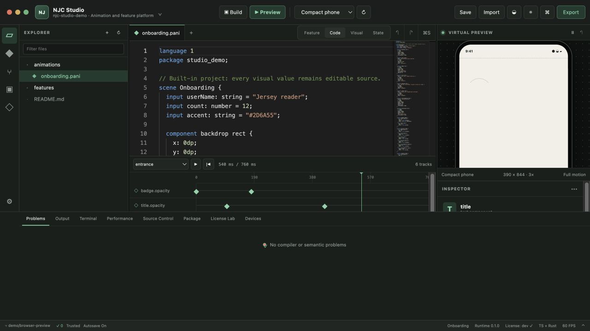

# Repository tools

`tools` contains developer-only applications and bounded utilities. The main
interactive product is [NJC Studio](studio/README.md), a Tauri desktop
workbench for PANI animation and visual-feature authoring.

