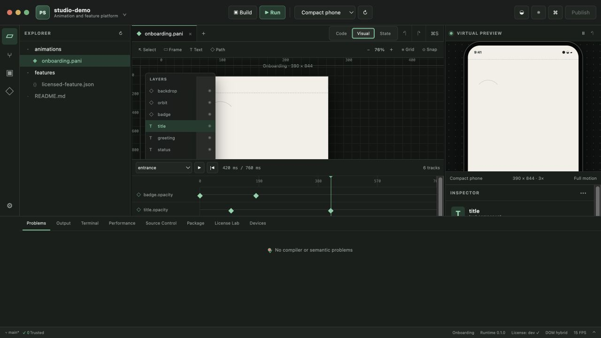

# Platform Studio

Platform Studio is the repository's desktop development environment for `.pani` animations and licensed feature modules. It uses Tauri 2, React, strict TypeScript, Monaco, and a narrow Rust backend.

The **Feature** editor also hosts the Visual Feature Composer: synchronized Design, Behavior, Data, Motion, Test and controlled-English Code modes over one typed Feature IR.



## Run it

From the repository root:

```bash
pnpm install
pnpm studio:start
```

Browser-only UI development is available with `pnpm studio:web`. It uses a clearly labeled built-in fixture and does **not** pretend to provide native filesystem, Git, toolchain, or task execution.

Verification and native compilation:

```bash
pnpm studio:check
pnpm studio:build
```

`studio:build` creates the native executable without installer bundling. Use `pnpm --dir tools/studio tauri build` on a correctly provisioned target operating system to create its native installer formats.

## Working vertical slice

- Open and confidence-detect this repository or another supported workspace without executing project code.
- Browse bounded files and open ordinary text, JSON, TypeScript, Rust, and `.pani` source in Monaco.
- Use parser-backed `.pani` completion, hover, symbols, definition lookup, formatting and diagnostics.
- Compile and checksum-verify a real FlatBuffers animation package with the shared compiler.
- Run the actual animation runtime in an integrated, honestly labeled virtual device preview.
- Edit source, visual component properties, keyframe timing/value/easing, runtime inputs, theme, device, orientation and reduced motion.
- Preserve comments and unrelated text through token/span-based visual edits; undo and redo grouped source revisions.
- Drive a live state machine, inspect active state and record accepted/rejected transition traces.
- Inspect package metadata, required features, source hash, performance samples, detections and host toolchains.
- Run allow-listed repository adapter tasks after explicit workspace trust, including the platform's real signed licensing demonstration and example-app build.
- Read Git status after trust without exposing a general shell.
- Recover unsaved source from a local snapshot and save with hash-based external-change detection plus atomic replacement.
- Add typed components through drag-and-drop or keyboard-accessible add controls, attach schema-suggested behavior, inspect the typed graph and edit its controlled-English projection.
- Bind application data, edit detailed keyframes and curves, simulate purchase success/failure and reduced motion, compile a checksum-protected feature package, and run a recorded interaction test.

The independently extractable implementation, package APIs, standalone playground, language grammar and threat model live in [`visual-feature-platform`](../../visual-feature-platform/README.md).

## Native boundary

The frontend has no filesystem or shell capability. Rust commands own canonical-path validation, symlink containment, bounded file reads, safe writes, toolchain diagnostics, Git status and task execution. Task adapters provide a fixed executable and argument array; the frontend cannot submit a shell command.

## Toolchain expectations

- Desktop Studio: Rust 1.77.2 or later, Node, pnpm, and the platform-specific Tauri prerequisites.
- Apple targets: full Xcode, selected Apple SDKs and signing on macOS. Command Line Tools alone are insufficient.
- Android targets: Android SDK, configured virtual devices and ADB.
- Flutter targets: Flutter SDK only when such a workspace is opened.

The diagnostics panel reports each missing tool with remediation. The Studio does not claim to replace Apple or Android SDKs.

## Current boundaries

The first milestone is a working IDE vertical slice, not the claim that every requested production feature is finished. The integrated terminal currently exposes finite, allow-listed task output rather than a cross-platform interactive PTY. General LSP process hosting, DAP, real emulator launching/log streaming, multi-window editing, full docking, Git staging/commit/discard, package extraction, signed updates, WASM extension execution, curve handles, path/mask/gradient editors, audio tracks and production licensing authentication remain subsequent milestones.

See [the implementation report](docs/IMPLEMENTATION_REPORT_2026-07-14.md) and [desktop-framework ADR](docs/architecture/0001-desktop-framework.md).
