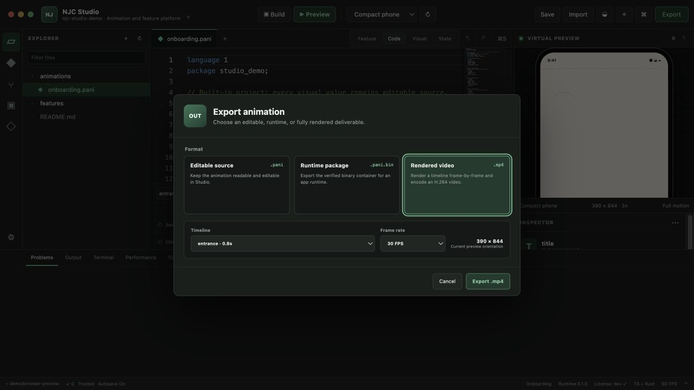

# NJC Studio

NJC Studio is The New Jersey Courier's desktop development environment for `.pani` animations and licensed visual-feature modules. Its original workbench borrows familiar IDE concepts—an explorer, command palette, editor modes, preview and diagnostics—without forking or imitating VS Code's product identity. It uses Tauri 2, React, strict TypeScript, Monaco, and a narrow Rust backend.

The **Feature** editor also hosts the Visual Feature Composer: synchronized Design, NJC Blueprints, Data, Motion, Test and readable English-programming Source modes over one typed Feature IR.


The native and browser workbenches share the same focused export workflow; desktop builds add verified runtime-frame MP4 encoding through the bounded Rust bridge.



## Run it

From the repository root:

```bash
pnpm install
pnpm studio:start
```

Browser-only UI development is available with `pnpm studio:web`. It uses a clearly labeled built-in fixture and does **not** pretend to provide native filesystem, Git, toolchain, or task execution.

Verification and native compilation:

```bash
pnpm studio:check
pnpm studio:build
```

`studio:build` creates the native executable without installer bundling. Use `pnpm --dir tools/studio tauri build` on a correctly provisioned target operating system to create its native installer formats.

## Working vertical slice

- Open and confidence-detect this repository or another supported workspace without executing project code.
- Create a valid animation from a headline or blank-stage template, then edit, save, compile, preview and inspect its package from one workflow.
- Search and collapse project files, refresh Explorer and Git status, and run real commands from a searchable keyboard command palette.
- Browse bounded files and open ordinary text, JSON, TypeScript, Rust, and `.pani` source in Monaco.
- Use parser-backed `.pani` completion, hover, symbols, definition lookup, formatting and diagnostics.
- Compile and checksum-verify a real FlatBuffers animation package with the shared compiler.
- Run the actual animation runtime in an integrated, honestly labeled virtual device preview.
- Edit source, visual component properties, keyframe timing/value/easing, runtime inputs, theme, device, orientation and reduced motion.
- Preserve comments and unrelated text through token/span-based visual edits; undo and redo grouped source revisions.
- Drive a live state machine, inspect active state and record accepted/rejected transition traces.
- Inspect package metadata, required features, source hash, performance samples, detections and host toolchains.
- Run allow-listed repository adapter tasks after explicit workspace trust, including the platform's real signed licensing demonstration and example-app build.
- Read Git status after trust without exposing a general shell.
- Recover unsaved source from a local snapshot and save with hash-based external-change detection plus atomic replacement.
- Autosave trusted workspace changes to disk after 1.2 seconds of editing inactivity, retain crash recovery until that write succeeds, and expose Save, Import, autosave and export controls in both the workbench and native macOS File menu.
- Import editable `.pani` source into the workspace; export editable source, a verifier-compatible `.pani.bin` runtime container, or an actual runtime-rendered MP4 timeline at 24, 30 or 60 FPS.
- Add typed components through drag-and-drop or keyboard-accessible add controls, attach schema-suggested behavior, inspect the typed graph and edit its controlled-English projection.
- Author behavior either as readable English-programming source or through draggable NJC Blueprint nodes with typed ports, schema-filtered actions and synchronized node inspection.
- Auto-arrange large NJC Blueprints with a deterministic, cycle-safe Rust graph engine in the desktop build and a clearly identified contract-compatible browser fallback.
- Bind application data, edit detailed keyframes and curves, simulate purchase success/failure and reduced motion, compile a checksum-protected feature package, and run a recorded interaction test.

The independently extractable implementation, package APIs, standalone playground, language grammar and threat model live in [`visual-feature-platform`](../../visual-feature-platform/README.md).

## Native boundary

The frontend has no filesystem or shell capability. Rust commands own canonical-path validation, symlink containment, bounded file reads, safe writes, toolchain diagnostics, Git status and task execution. Task adapters provide a fixed executable and argument array; the frontend cannot submit a shell command.

## Toolchain expectations

- NJC Studio desktop: Rust 1.77.2 or later, Node, pnpm, and the platform-specific Tauri prerequisites. Rendered MP4 export also needs FFmpeg with VideoToolbox, libx264, or MPEG-4 encoding support.
- Apple targets: full Xcode, selected Apple SDKs and signing on macOS. Command Line Tools alone are insufficient.
- Android targets: Android SDK, configured virtual devices and ADB.
- Flutter targets: Flutter SDK only when such a workspace is opened.

The diagnostics panel reports each missing tool with remediation. The Studio does not claim to replace Apple or Android SDKs.

## Current boundaries

NJC Studio is a working IDE vertical slice, not the claim that every requested production feature is finished. The integrated terminal currently exposes finite, allow-listed task output rather than a cross-platform interactive PTY. General LSP process hosting, DAP, real emulator launching/log streaming, multi-window editing, full docking, Git staging/commit/discard, signed updates, WASM extension execution, curve handles, path/mask/gradient editors, audio tracks and production licensing authentication remain subsequent milestones.

See [saving, importing and exporting](docs/SAVING_AND_EXPORTING.md), [the complete language and Blueprints guide](../../visual-feature-platform/docs/language/authoring-language-and-blueprints.md), [production readiness](docs/PRODUCTION_READINESS.md), [the implementation report](docs/IMPLEMENTATION_REPORT_2026-07-14.md), [desktop-framework ADR](docs/architecture/0001-desktop-framework.md), and [native-acceleration ADR](docs/architecture/0002-native-acceleration.md).
