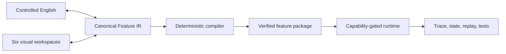

# Visual Feature Composer implementation report

Date: 2026-07-14

## Outcome

This change establishes a working, extraction-ready Visual Feature Composer foundation inside the existing desktop Studio. It is a substantial vertical slice, not a claim that every item in the nine-milestone product specification is complete.

The implementation proves the central architecture end to end:



The same `FeatureIR` is used by the Studio, controlled-language projection, compiler, runtime, tests, and standalone playground. Visual editing and supported source edits therefore update the same model instead of maintaining separate representations.

## Applications and packages inspected

- Existing Tauri/React desktop Studio in `tools/studio`.
- Existing Studio web fallback, source editor, preview, inspector, runtime, tests, Tauri permissions, build scripts, and CI integration.
- Root pnpm workspace and scripts.
- Existing platform playground and shared platform packages, to avoid replacing or duplicating working systems.
- Repository CI workflow and native Rust test/build paths.

The new workspace lives under `visual-feature-platform` so it can be extracted without rewriting the current repository. It contains:

- `@visual-feature/model` — canonical typed IR, component registry, suggestions, validation, stable IDs, examples.
- `@visual-feature/language` — deterministic formatter/parser and editor language services.
- `@visual-feature/compiler` — canonical JSON, SHA-256 checksums, deterministic packaging, verification, compatibility diagnostics.
- `@visual-feature/runtime` — entitlement/capability gates, typed connectors, bounded execution, traces, redacted recording/replay, test runner.
- `@visual-feature/playground` — standalone browser application with purchase and live-information examples.

## Studio experience delivered

The Studio now exposes a dedicated `Feature` editor with six coordinated modes:

1. **Design** — component library, keyboard-accessible add controls, device preview, schema-derived inspector, bindings, accessibility fields.
2. **Behavior** — typed behavior graph, success/failure paths, context-relevant actions, controlled-English projection.
3. **Data** — schema/table views, reactive binding map, mock data, connector contracts.
4. **Motion** — compositions, property tracks, detailed keyframes, interpolation, cubic and spring parameters, reduced-motion alternative.
5. **Test** — deterministic success/failure connectors, guided execution, reduced motion, recorded test runner, state/package/trace inspection.
6. **Code** — editable controlled English, formatting, diagnostics, and source-to-visual application.

The existing animation editor remains available. Composer mode hides animation-only timeline/sidecar surfaces instead of forcing feature authoring into those controls.

## Canonical model and authoring language

`FeatureIR` currently models:

- metadata, versions, compatibility, localization, entitlements, and required capabilities;
- typed data schemas and fields;
- feature/screen state;
- screens and component trees;
- reactive bindings;
- typed behavior nodes and control/data edges;
- connector and operation contracts;
- motion compositions, tracks, keyframes, curves, springs, and reduced-motion alternatives;
- recorded tests and assertions.

Stable IDs are explicit in controlled English. The formatter is deterministic. The current parser safely round-trips metadata, component content, and confirmation text into the visual model. Language services provide completions, symbols, definitions, formatting, and diagnostics for the implemented grammar subset.

Validation covers duplicate IDs, missing references, type mismatches, binding cycles, accessibility requirements, unsafe network URLs, credential placement, and structural limits.

## Runtime, packaging, and security

Packages use a deterministic `VFCPKG` envelope with canonical JSON, semantic version metadata, payload length, and SHA-256 integrity. The verifier rejects tampering and unsupported compatibility before runtime loading.

Runtime controls include:

- server/host-provided entitlement and capability checks;
- typed connector invocation with explicit success and failure paths;
- bounded behavior execution and trace retention;
- reduced-motion selection;
- URL and credential policy validation;
- redacted, bounded live-event recording and deterministic replay;
- authorization boundaries that do not rely on a hidden client screen.

The threat model is documented in `docs/security/threat-model.md`. Tauri-facing integration continues to use the repository's allow-listed command/capability model, consistent with the official [Tauri capability guidance](https://v2.tauri.app/security/capabilities/).

## Demonstration features

### Purchase confirmation

The example contains bound product content, a confirmation dialog, loading state, typed purchase connector, explicit success/failure branches, animated success state, reduced-motion behavior, and a recorded interaction test.

### Live information

The example contains a live-score model, image/video fixture, WebSocket connector contract, reconnect/stale/throttling configuration, data-change animation, event recording/replay, and a deterministic test. The current playground simulates the live transport; it does not claim to be a production media or WebSocket implementation.

## Verification results

All checks below passed on the development Mac on 2026-07-14:

- Visual feature platform: 13 tests.
- Studio: 6 tests across 4 test files.
- Studio strict TypeScript check.
- Studio ESLint check.
- Studio and standalone playground production Vite builds.
- Tauri Rust: 3 tests.
- Native Tauri release binary build at `tools/studio/src-tauri/target/release/platform-studio`.
- Browser verification at `http://127.0.0.1:1420/`:
  - Composer opened through the Studio `Feature` mode.
  - all six modes rendered;
  - controlled English changed `Purchase` to `Buy now` and the Design view updated;
  - recorded success assertions passed;
  - typed connector failure reached `PurchaseStatus = failure` and displayed `PurchaseError`;
  - behavior graph, bindings, connector contracts, motion curve, and detailed interpolation controls rendered;
  - viewport had no horizontal document overflow;
  - no console warnings/errors and no Vite error overlay.

Development benchmark fixture:

| Measure | Result |
| --- | ---: |
| Components | 259 |
| Behavior nodes | 11 |
| Keyframes | 7 |
| Compiled package | 68,089 bytes |
| Compile | 21.07 ms |
| Runtime load | 4.40 ms |
| Behavior execution | 0.82 ms |
| Record 1,000 events | 0.93 ms |
| Heap delta | 801,264 bytes |

These are one-machine development measurements, not cross-platform performance guarantees.

## CI and extraction

The root CI workflow now has a `visual-feature-composer` job that installs both workspaces, runs the Composer check suite, and verifies Studio tests/typecheck/lint. The nested workspace has its own `package.json`, lockfile, and `pnpm-workspace.yaml`, following the documented [pnpm workspace model](https://pnpm.io/workspaces).

The canonical schema is published as JSON Schema 2020-12 in `schemas/feature/feature-ir.schema.json`, using the current [JSON Schema 2020-12 specification](https://json-schema.org/draft/2020-12).

See `docs/release/extraction.md` for the repository-separation procedure.

## Accessibility work

The Composer uses semantic buttons, labels, regions, fieldsets, tables, and text alternatives. Component insertion has a keyboard/click path in addition to drag and drop. Focusable controls retain visible focus behavior, and the runtime exposes reduced-motion handling. The design follows the [WAI-ARIA Authoring Practices keyboard guidance](https://www.w3.org/WAI/ARIA/apg/practices/keyboard-interface/).

This is a strong baseline, not a completed screen-reader and keyboard audit across macOS, Windows, and Linux.

## Known limits and remaining milestones

The following parts of the full specification remain deliberately unclaimed:

- The registry has 14 typed component schemas, not the final comprehensive component catalog.
- Component drag/drop currently inserts into the root layout; full tree reordering, nesting, grouping, snapping, constraints, and breakpoint authoring remain.
- The behavior surface is a typed projection with guided graph extension; it is not yet a complete freeform node/edge graph editor.
- Controlled English covers the implemented feature subset; it is not the final grammar, arbitrary graph constructor, or a complete external LSP.
- Motion includes editable numeric keyframes and a value-curve view, but not draggable Bézier handles, speed graphs, spatial paths, vector shape authoring, or the full After Effects-class toolset.
- Connector interfaces and policies are implemented, but production GraphQL, SSE, WebSocket, authentication, retry, caching, offline, and test-console transports remain.
- The live-information demo uses deterministic simulated events and a media fixture, not a production stream/player stack.
- Current application integration uses a development host identity; native target code generation and wiring into a real user-app screen remain.
- There are two complete demonstration features, not the requested 40 examples and three full real applications.
- Plugin SDK/sandbox, signed publisher packages, marketplace, collaboration, and extension lifecycle are not implemented.
- Secure persisted Studio state, complete localization tooling, navigation builder, visual form validation builder, record-mode UI, and full asset pipeline remain.
- Cross-platform packaging/signing/installers and a device/browser accessibility matrix still require their respective environments and credentials.

## Recommended next implementation order

1. Complete tree layout editing, breakpoints, constraints, and component registry coverage.
2. Expand the grammar/parser and freeform typed graph editing while retaining one canonical IR.
3. Build production connector transports plus authentication, retry, caching, offline behavior, and a connector test console.
4. Add advanced motion graph/path tooling and visual state transitions.
5. Implement target adapters and integrate the package into one real application screen.
6. Add secure persistence, localization/navigation/forms, and record-mode UX.
7. Build the plugin sandbox/SDK and package signing.
8. Grow the fixture suite toward 40 examples and three representative applications.
9. Complete platform installers, signing, performance baselines, accessibility audits, and release evidence.

## Commands

```bash
pnpm composer:check
pnpm composer:demo
pnpm composer:benchmark
pnpm composer:playground
pnpm studio:web
pnpm studio:build
```
