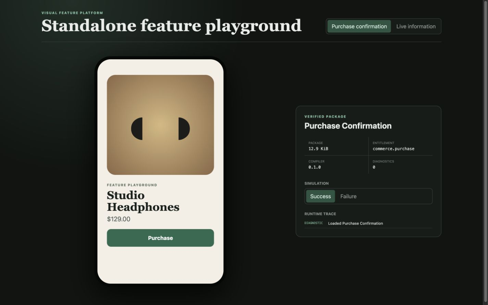

# `@visual-feature/runtime`

This package loads verified feature packages into a capability- and
entitlement-aware host, executes bounded behavior graphs, owns runtime state,
adapts connectors, applies reduced-motion choices and records a bounded trace.

The host supplies approved connectors; a package cannot reach the filesystem,
network, credentials or application navigation merely by naming them.
